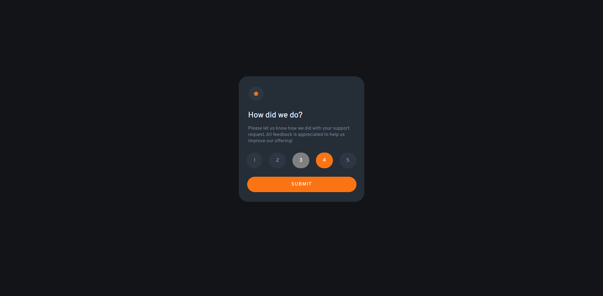
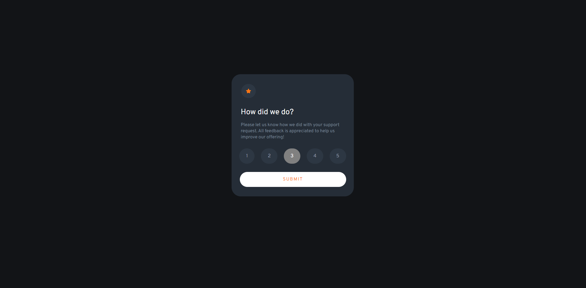
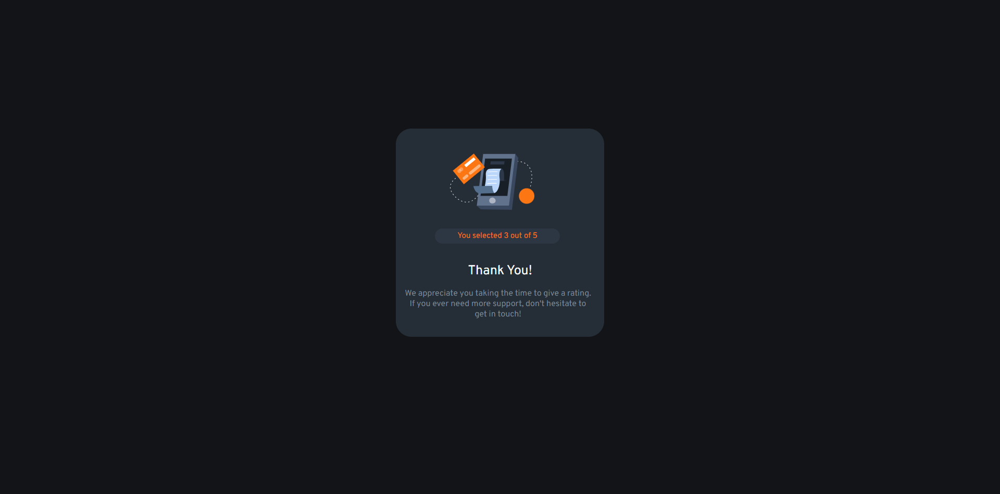

# Frontend Mentor - Interactive rating component solution

This is a solution to the [Interactive rating component challenge on Frontend Mentor](https://www.frontendmentor.io/challenges/interactive-rating-component-koxpeBUmI). Frontend Mentor challenges help you improve your coding skills by building realistic projects. 

## Table of contents

- [Overview](#overview)
  - [The challenge](#the-challenge)
  - [Screenshot](#screenshot)
- [My process](#my-process)
  - [Built with](#built-with)
  - [What I learned](#what-i-learned)

## Overview

### The challenge

Users should be able to:

- View the optimal layout for the app depending on their device's screen size
- See hover states for all interactive elements on the page
- Select and submit a number rating
- See the "Thank you" card state after submitting a rating

### Screenshot





## My process

### Built with

- HTML
- CSS Flexbox
- JS

### What I learned

In this project, I learned how to select a single rating out of five rating options, store the selected rating, and display it on a second page using JS DOM manipulation.

```js
for (const button of formbuttons) {
	button.addEventListener("click", () => {
		for (const buttons2 of formbuttons) {
			if (buttons2.id !== button.id) {
				buttons2.style.backgroundColor = "hsl(214, 20%, 22%)"; // orange
			} else {
				buttons2.style.backgroundColor = "gray"; // gray
				buttons2.style.color = "hsl(0, 0%, 100%)"; // white
				rating.innerText = buttons2.id;
			}
		}
	})
}
```